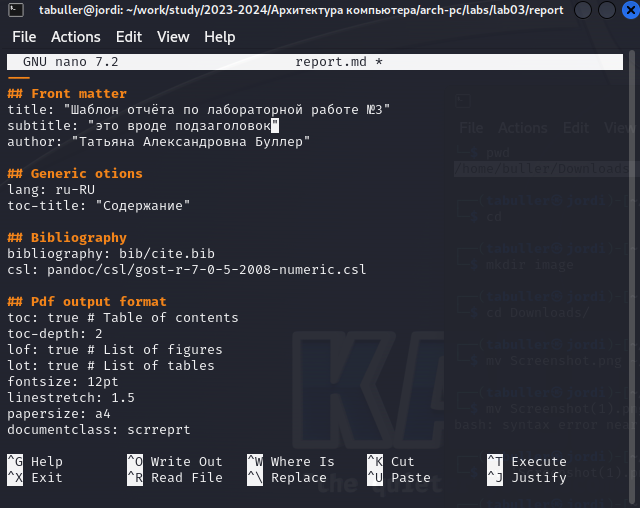
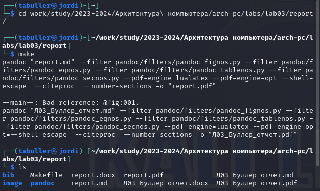
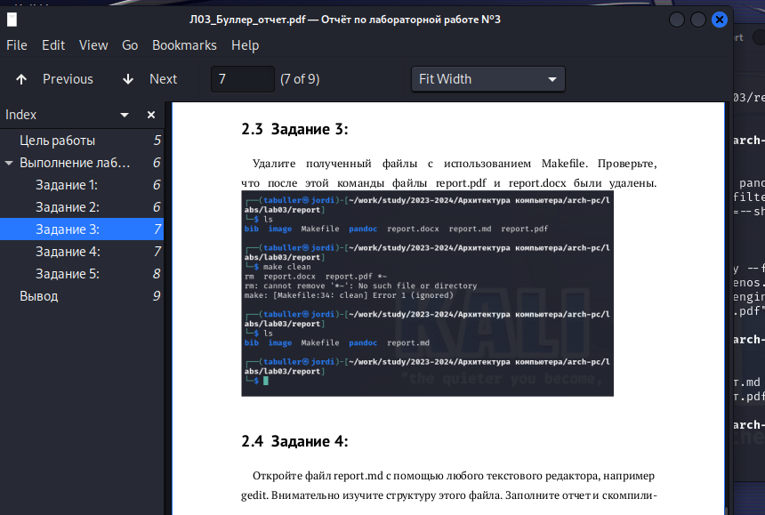

---
## Front matter
title: "Отчёт по лабораторной работе №3"
subtitle: "Язык разметки Markdown"
author: "Татьяна Александровна Буллер"
## Generic otions
lang: ru-RU
toc-title: "Содержание"
## Bibliography
bibliography: bib/cite.bib
csl: pandoc/csl/gost-r-7-0-5-2008-numeric.csl
## Pdf output format
toc: true # Table of contents
toc-depth: 2
lof: true # List of figures
lot: false # List of tables
fontsize: 12pt
linestretch: 1.5
papersize: a4
documentclass: scrreprt
## I18n polyglossia
polyglossia-lang:
  name: russian
  options:
	- spelling=modern
	- babelshorthands=true
polyglossia-otherlangs:
  name: english
## I18n babel
babel-lang: russian
babel-otherlangs: english
## Fonts
mainfont: PT Serif
romanfont: PT Serif
sansfont: PT Sans
monofont: PT Mono
mainfontoptions: Ligatures=TeX
romanfontoptions: Ligatures=TeX
sansfontoptions: Ligatures=TeX,Scale=MatchLowercase
monofontoptions: Scale=MatchLowercase,Scale=0.9
## Biblatex
biblatex: true
biblio-style: "gost-numeric"
biblatexoptions:
  - parentracker=true
  - backend=biber
  - hyperref=auto
  - language=auto
  - autolang=other*
  - citestyle=gost-numeric
## Pandoc-crossref LaTeX customization
figureTitle: "Рис."
tableTitle: "Таблица"
listingTitle: "Листинг"
lofTitle: "Список иллюстраций"
lotTitle: "Список таблиц"
lolTitle: "Листинги"
## Misc options
indent: true
header-includes:
  - \usepackage{indentfirst}
  - \usepackage{float} # keep figures where there are in the text
  - \floatplacement{figure}{H} # keep figures where there are in the text
---
# Цель работы
Целью работы является освоение процедуры оформления отчетов с помощью легковесного языка разметки Markdown.

# Выполнение лабораторной работы

## Задание 1:
Откройте терминал. Перейдите в каталог курса сформированный при выполнении лабораторной работы №2.
Обновите локальный репозиторий, скачав изменения из удаленного репозитория.

.png){ #fig:001 width=90% }

С момента последнего обновления репозитория были выгружены файлы с отчетами по двум лабораторным работам, что отражено в выводе, последовавшим после выполнения ```git pull```.

## Задание 2:
Перейдите в каталог с шаблоном отчета по лабораторной работе № 3. Проведите компиляцию шаблона с использованием ```Makefile```. При успешной компиляции должны сгенерироваться файлы ```report.pdf``` и ```report.docx```.
Откройте и проверьте корректность полученных файлов.

.png){ #fig:001 width=90% }

Шаблоны скомпилировались, что отражает вывод команды ls после команды компиляции make. В списке файлов рабочей директории отображаются ```report.docx``` и ```report.pdf```

## Задание 3:
Удалите полученный файлы с использованием ```Makefile```. Проверьте, что после этой команды файлы ```report.pdf``` и ```report.docx``` были удалены.

.png){ #fig:001 width=90% }

```make clean``` удалила созданные файлы ```report.pdf``` и ```report.docx```: при последующей проверке с помощью команды ls они исчезли из списка файлов директории.

## Задание 4:
Откройте файл ```report.md``` c помощью любого текстового редактора, например ```gedit```. Внимательно изучите структуру этого файла. Заполните отчет и скомпилируйте отчет с использованием ```Makefile```. 

{ #fig:001 width=90% }

Файл шаблона был открыт с помощью встроенного текстового редактора nano. Результат заполнения скомпилирован в данный файл.

## Задание 5:
Проверьте корректность полученных файлов.
Обратите внимание, для корректного отображения скриншотов они должны быть размещены в каталоге image.

{ #fig:001 width=90% }

Файлы скомпилировались и отображаются при проверке содержимого директории командой ls. Необходимо проверить корректность компиляции их содержимого.

{ #fig:001 width=90% }

# Вывод
При выполнении лабораторной работы была освоена процедура оформления отчетов с помощью легковесного языка разметки Markdown, базовые элементы его разметки и процедура воскрешения погибшего после первой же сессии ```lualatex```.

