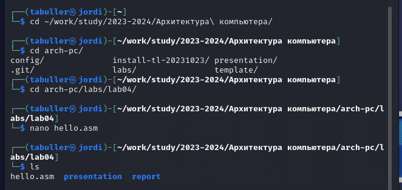

---
## Front matter
title: "Отчёт по лабораторной работе №4"
subtitle: "Создание и процесс
обработки программ на языке ассемблера NASM"
author: "Татьяна Александровна Буллер"
## Generic otions
lang: ru-RU
toc-title: "Содержание"
## Bibliography
bibliography: bib/cite.bib
csl: pandoc/csl/gost-r-7-0-5-2008-numeric.csl
## Pdf output format
toc: true # Table of contents
toc-depth: 2
lof: true # List of figures
lot: true # List of tables
fontsize: 12pt
linestretch: 1.5
papersize: a4
documentclass: scrreprt
## I18n polyglossia
polyglossia-lang:
  name: russian
  options:
	- spelling=modern
	- babelshorthands=true
polyglossia-otherlangs:
  name: english
## I18n babel
babel-lang: russian
babel-otherlangs: english
## Fonts
mainfont: PT Serif
romanfont: PT Serif
sansfont: PT Sans
monofont: PT Mono
mainfontoptions: Ligatures=TeX
romanfontoptions: Ligatures=TeX
sansfontoptions: Ligatures=TeX,Scale=MatchLowercase
monofontoptions: Scale=MatchLowercase,Scale=0.9
## Biblatex
biblatex: true
biblio-style: "gost-numeric"
biblatexoptions:
  - parentracker=true
  - backend=biber
  - hyperref=auto
  - language=auto
  - autolang=other*
  - citestyle=gost-numeric
## Pandoc-crossref LaTeX customization
figureTitle: "Рис."
tableTitle: "Таблица"
listingTitle: "Листинг"
lofTitle: "Список иллюстраций"
## Misc options
indent: true
header-includes:
  - \usepackage{indentfirst}
  - \usepackage{float} # keep figures where there are in the text
  - \floatplacement{figure}{H} # keep figures where there are in the text
---
# Цель работы
Освоение процедуры компиляции и сборки программ, написанных на ассемблере NASM.

# Выполнение лабораторной работы

## Задание 1.
Создайте текстовый файл с именем hello.asm. Откройте этот файл с помощью любого текстового редактора, например, gedit.

{ #fig:001 width=90% }

Для создания и редактирования файла использовался текстовый редактор nano. При открытии файла с заданным именем он создается автоматически, если до этого отсутствует в каталоге, в чем можно убедиться проверкой содержимого посредством введения команды ls.

## Задание 2.
Введите код программы в документ.

.png){ #fig:001 width=90% }

Комментарии - текст, отделенный от строки кода знаком ; - не выполняются при компиляции программы, поэтому были вырезаны. 

## Задание 3.
NASM превращает текст программы в объектный код. Например, для компиляции приведённого выше текста программы «Hello World» необходимо написать:
```nasm -f elf hello.asm```

.png){ #fig:001 width=90% }

Сообщения об ошибке не последовало и при проверке содержимого командой ls можно видеть, что объектный файл (hello.o) создан

## Задание 4.
Выполните следующую команду:
```nasm -o obj.o -f elf -g -l list.lst hello.asm```

.png){ #fig:001 width=90% }

При проверке содержимого каталога можно видеть, что в нем появились новые файлы, созданные на основе hello.asm: объектный файл obj.o, указание на создание которого передается первой частью команды; и файл листинга программы list.lst, указание к созданию которого передается второй частью команды.

## Задание 5.
Для того, чтобы получить исполняемый файл, объектный файл необходимо передать на обработку компоновщику:
```ld -m elf_i386 hello.o -o hello``` 

.png){ #fig:001 width=90% }

При очередной проверке содержимого каталога можно видеть, что появился файл hello, подсвеченный зеленым цветом. Это указывает на то, что данный файл - исполняемый.

## Задание 6.
Выполните следующую команду:
```ld -m elf_i386 obj.o -o main``` 

.png){ #fig:001 width=90% }

При проверке содержимого каталога можно видеть, что исполняемый появился файл main, собранный на основе файла obj.o по указанию написанной выше команды. 

## Задание 7.
Запустить на выполнение созданный исполняемый файл, находящийся в текущем каталоге, можно, набрав в командной строке:
```./hello``` 

.png){ #fig:001 width=90% }

Исполняемый файл запустился без ошибок и выдал именно то, что и должен был выдать: "привет, мир".

# Задание для самостоятельной работы

## Задание 1.
С помощью команды cp создайте копию файла hello.asm с именем lab4.asm.

.png){ #fig:001 width=90% }

При проверке содержимого каталога появился файл lab04.asm: команда выполнена успешно.

## Задание 2.
С помощью любого текстового редактора внесите изменения в текст программы в файле lab4.asm так, чтобы вместо "Hello world!" на экран выводилась строка с вашими фамилией и именем.

.png){ #fig:001 width=90% }

Изменить нужно совсем немного: заменить текст Hello world на мое имя и, красоты ради, переименовать метки из hello и helloLen в name и nameLen соответственно.

## Задание 3.
Оттранслируйте полученный текст программы lab4.asm в объектный файл. Выполните компоновку объектного файла и запустите получившийся исполняемый файл.

.png){ #fig:001 width=90% }

По уже известному алгоритму создаем объектный файл, передаем его компоновщику для получения исполняемого файла и запускаем. По итогу работы выведена строчка с именем, что и требовалось получить.

## Задание 4.
Скопируйте файлы hello.asm и lab4.asm в Ваш локальный репозиторий в каталог ~/work/study/2023-2024/"Архитектура компьютера"/arch-pc/labs/lab04/.
Загрузите файлы на Github.

Работа изначально проводилась в каталоге ../labs/lab04, повторное копирование излишне. Файлы были загружены в репозиторий через терминал.

# Вывод
Были освоены базовые элементы языка ассемблера NASM, а также порядок трансляции, сборки и запуска программ.
