---
## Front matter
title: ". Основы работы с
Midnight Commander (mc). Структура программы на
языке ассемблера NASM. Системные вызовы в ОС
GNU Linux"
subtitle: "Язык разметки Markdown"
author: "Татьяна Александровна Буллер"
## Generic otions
lang: ru-RU
toc-title: "Содержание"
## Bibliography
bibliography: bib/cite.bib
csl: pandoc/csl/gost-r-7-0-5-2008-numeric.csl
## Pdf output format
toc: true # Table of contents
toc-depth: 2
lof: true # List of figures
lot: false # List of tables
fontsize: 12pt
linestretch: 1.5
papersize: a4
documentclass: scrreprt
## I18n polyglossia
polyglossia-lang:
  name: russian
  options:
	- spelling=modern
	- babelshorthands=true
polyglossia-otherlangs:
  name: english
## I18n babel
babel-lang: russian
babel-otherlangs: english
## Fonts
mainfont: PT Serif
romanfont: PT Serif
sansfont: PT Sans
monofont: PT Mono
mainfontoptions: Ligatures=TeX
romanfontoptions: Ligatures=TeX
sansfontoptions: Ligatures=TeX,Scale=MatchLowercase
monofontoptions: Scale=MatchLowercase,Scale=0.9
## Biblatex
biblatex: true
biblio-style: "gost-numeric"
biblatexoptions:
  - parentracker=true
  - backend=biber
  - hyperref=auto
  - language=auto
  - autolang=other*
  - citestyle=gost-numeric
## Pandoc-crossref LaTeX customization
figureTitle: "Рис."
tableTitle: "Таблица"
listingTitle: "Листинг"
lofTitle: "Список иллюстраций"
lotTitle: "Список таблиц"
lolTitle: "Листинги"
## Misc options
indent: true
header-includes:
  - \usepackage{indentfirst}
  - \usepackage{float} # keep figures where there are in the text
  - \floatplacement{figure}{H} # keep figures where there are in the text
---
# Цель работы
Приобретение практических навыков работы в Midnight Commander. Освоение инструкций языка ассемблера ```mov``` и ```int```.

# Выполнение лабораторной работы

## Задание 1:
Откройте Midnight Commander. Пользуясь клавишами ↑ , ↓ и Enter перейдите в каталог ```~/work/arch-pc```. Пользуясь строкой ввода и командой ```touch``` создайте файл ```lab5-1.asm```.

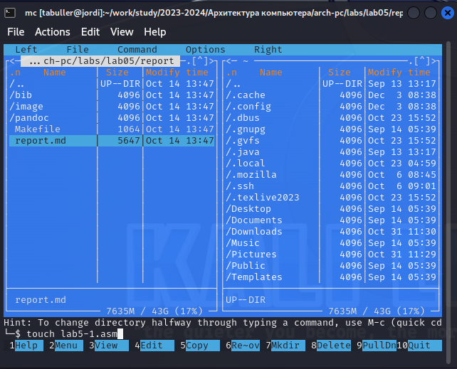{ #fig:001 width=90% }

Midnight Commander не был предустановлен на используемом мною дистрибутиве, но после установки работал исправно. В столбце справа можно видеть содержание директории ```lab05/report```, в столбце слева - домашней директории. В строчке снизу введена команда для создания файла.

## Задание 2:
С помощью функциональной клавиши F4 откройте файл ```lab5-1.asm``` для редактирования во встроенном редакторе. 

{ #fig:001 width=90% }

Из предложенных на выбор редакторов я выбрала ```nano```, для чего ввела в строку цифру 1.

## Задание 3:
Введите текст программы из листинга 5.1 (можно без комментариев), сохраните изменения и закройте файл.

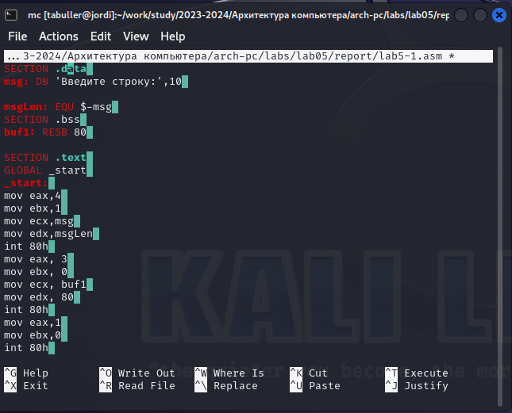{ #fig:001 width=90% }

Текст программы скопирован, комментарии удалены. Изменения сохранены. Работает.

## Задание 4:
С помощью функциональной клавиши F3 откройте файл ```lab5-1.asm``` для просмотра.
Убедитесь, что файл содержит текст программы. 

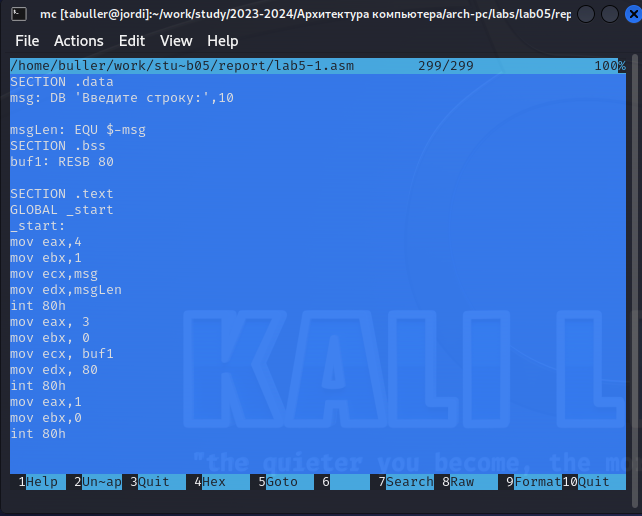{ #fig:001 width=90% }

Символ-в-символ тот же самый текст, что был введен и до этого. Сохранение успешно.

## Задание 5:
Оттранслируйте текст программы ```lab5-1.asm``` в объектный файл. Выполните компоновку объектного файла и запустите получившийся исполняемый файл. Программа выводит строку ```'Введите строку:'``` и ожидает ввода с клавиатуры. На запрос введите Ваши ФИО.

{ #fig:001 width=90% }

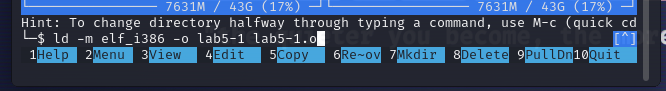{ #fig:001 width=90% }

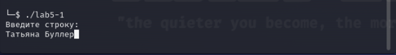{ #fig:001 width=90% }

Программа скомпилировалась и выполнилась успешно: попросила меня ввести строку и закрылась сразу же после ввода.

## Задание 6:
В одной из панелей mc откройте каталог с файлом ```lab5-1.asm```. В другой панели каталог со скаченным файлом ```in_out.asm``` (для перемещения между панелями используйте Tab).
Скопируйте файл in_out.asm в каталог с файлом ```lab5-1.asm``` с помощью функциональной клавиши F5.

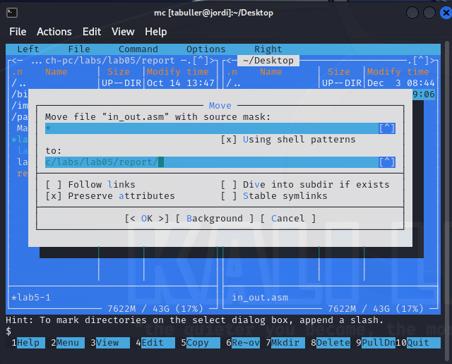{ #fig:001 width=90% }

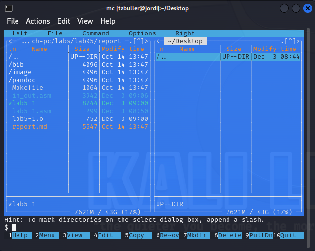{ #fig:001 width=90% }

Файл, лежавший до этого на рабочем столе, исчез оттуда после копирования и появился в директории лабораторной работы: копирование выполнено успешно.

## Задание 7:
С помощью функциональной клавиши F6 создайте копию файла ```lab5-1.asm``` с именем ```lab5-2.asm```. Выделите файл ```lab5-1.asm```, нажмите клавишу F6, введите имя файла ```lab5-2.asm``` и нажмите клавишу Enter 

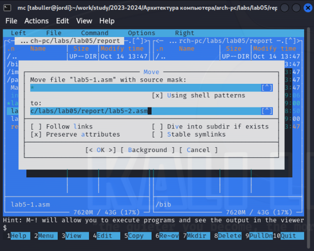{ #fig:001 width=90% }

## Задание 8:
Исправьте текст программы в файле ```lab5-2.asm``` с использование подпрограмм из внешнего файла ```in_out.asm``` (используйте подпрограммы ```sprintLF```, ```sread``` и ```quit```) в соответствии с листингом 5.2. Создайте исполняемый файл и проверьте его работу

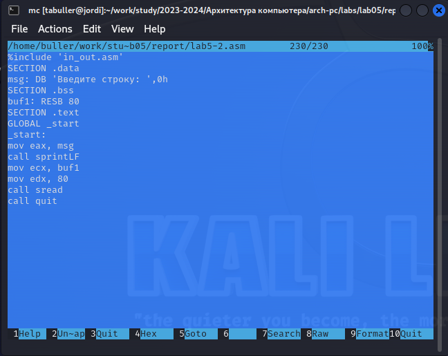{ #fig:001 width=90% }

В начало файла указана команда на подключение внешнего файла ```in_out.asm```, в котором описаны подпрограммы ```sprintLF```, ```sread``` и ```quit```. Они вызываются далее в тексте программы, заменяя часть команд ```mov```.

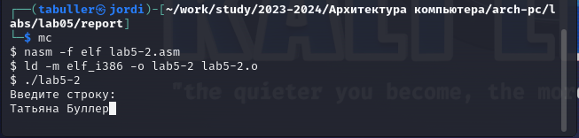{ #fig:001 width=90% }

Программа скомпилировалась успешно и снова попросила меня ввести строку, после чего завершилась.

## Задание 9:
В файле ```lab5-2.asm``` замените подпрограмму ```sprintLF``` на ```sprint```. Создайте исполняемый файл и проверьте его работу. В чем разница?

{ #fig:001 width=90% }

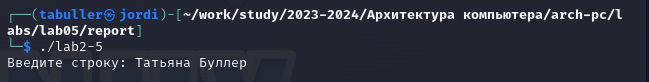{ #fig:001 width=90% }

Программа скомпилировалась без значительных изменений, но замена ```sprintLF``` на ```sprint``` привела к тому, что исчез символ переноса строки при выводе сообщения на экран.

# Задание для самостоятельной работы

## Задание 10:
Создайте копию файла ```lab5-1.asm```. Внесите изменения в программу (без использования внешнего файла ```in_out.asm```), так чтобы она работала по следующему алгоритму:
* вывести приглашение типа “Введите строку:”;
* ввести строку с клавиатуры;
* вывести введённую строку на экран.
Получите исполняемый файл и проверьте его работу. На приглашение ввести строку введите свою фамилию.

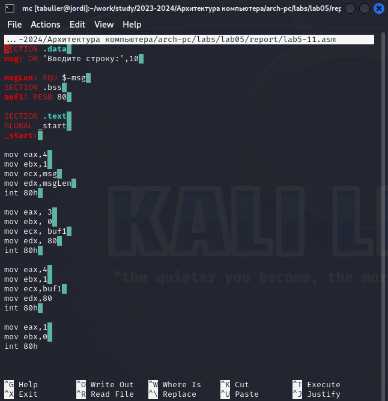{ #fig:001 width=90% }

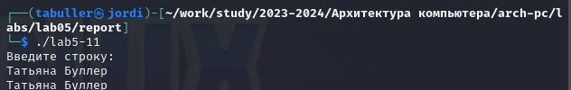{ #fig:001 width=90% }

Для того, чтобы после введения строки полученный ввод был показан еще раз, скопируем блок вывода текста за одним исправлением: вместо переменной ```msg``` теперь нужно вывести полученный ввод (он сохраняется в переменную ```buf1```). при компиляции программы можно видеть, что это работает именно так, как и было задумано.

## Задание 11:
Создайте копию файла ```lab5-2.asm```. Исправьте текст программы с использование подпрограмм из внешнего файла ```in_out.asm```, так чтобы она работала по следующему алгоритму:
* вывести приглашение типа “Введите строку:”;
* ввести строку с клавиатуры;
* вывести введённую строку на экран.
Получите исполняемый файл и проверьте его работу. На приглашение ввести строку введите свою фамилию.

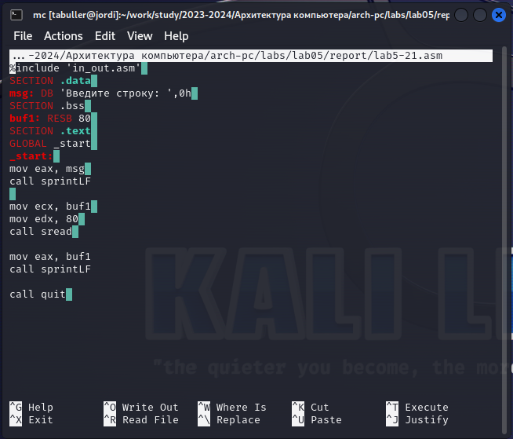{ #fig:001 width=90% }

{ #fig:001 width=90% }

Для того, чтобы после введения строки полученный ввод был показан еще раз, в этот раз просто еще один раз вызовем команду ```sprintLF```. При компиляции программы можно видеть, что это работает именно так, как и было задумано.

# Вывод
При выполнении лабораторной работы были приобретены практические навыки работы в Midnight Commander и освоены инструкции языка ассемблера ```mov``` и ```int```.

