---
## Front matter
title: "Отчет по лабораторной работе №6"
subtitle: "Арифметические
операции в NASM"
author: "Татьяна Александровна Буллер"
## Generic otions
lang: ru-RU
toc-title: "Содержание"
## Bibliography
bibliography: bib/cite.bib
csl: pandoc/csl/gost-r-7-0-5-2008-numeric.csl
## Pdf output format
toc: true # Table of contents
toc-depth: 2
lof: true # List of figures
lot: false # List of tables
fontsize: 12pt
linestretch: 1.5
papersize: a4
documentclass: scrreprt
## I18n polyglossia
polyglossia-lang:
  name: russian
  options:
	- spelling=modern
	- babelshorthands=true
polyglossia-otherlangs:
  name: english
## I18n babel
babel-lang: russian
babel-otherlangs: english
## Fonts
mainfont: PT Serif
romanfont: PT Serif
sansfont: PT Sans
monofont: PT Mono
mainfontoptions: Ligatures=TeX
romanfontoptions: Ligatures=TeX
sansfontoptions: Ligatures=TeX,Scale=MatchLowercase
monofontoptions: Scale=MatchLowercase,Scale=0.9
## Biblatex
biblatex: true
biblio-style: "gost-numeric"
biblatexoptions:
  - parentracker=true
  - backend=biber
  - hyperref=auto
  - language=auto
  - autolang=other*
  - citestyle=gost-numeric
## Pandoc-crossref LaTeX customization
figureTitle: "Рис."
tableTitle: "Таблица"
listingTitle: "Листинг"
lofTitle: "Список иллюстраций"
lotTitle: "Список таблиц"
lolTitle: "Листинги"
## Misc options
indent: true
header-includes:
  - \usepackage{indentfirst}
  - \usepackage{float} # keep figures where there are in the text
  - \floatplacement{figure}{H} # keep figures where there are in the text
---
# Цель работы
Освоение арифметических инструкций языка ассемблера NASM.

# Выполнение лабораторной работы

## Задание 1:
Создайте каталог для программам лабораторной работы № 6, перейдите в него и создайте файл ```lab6-1.asm```.

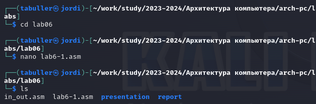{ #fig:001 width=90% }

Для дальнейшего успешного выполнения программы из листинга необходимо, чтобы файл ```in_out.asm``` находился в одном каталоге с рабочими файлами. Он был скопирован заранее, правильность копирования проверена с помощью команды ```ls```.

## Задание 2:
Введите в файл ```lab6-1.asm``` текст программы из листинга 6.1, создайте исполняемый файл и запустите его.

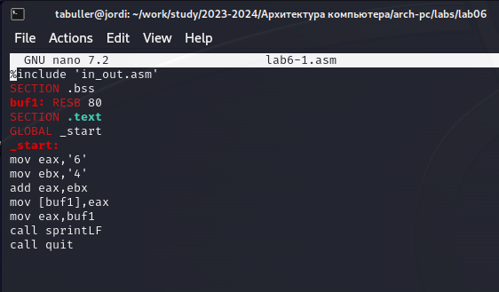{ #fig:001 width=90% }

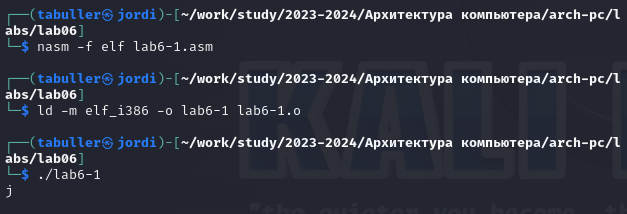{ #fig:001 width=90% }

Чего и следовало ожидать, вместо числа 10 в результат выводится символ 'j': в регистр ```eax``` была записана сумма кодов символов (106), что соответствует коду символа 'j'.

## Задание 3:
Исправьте текст программы, записав в регистры числа. Создайте исполняемый файл и запустите его. Пользуясь таблицей ASCII определите какому символу соответствует код 10. Отображается ли этот символ при выводе на экран?

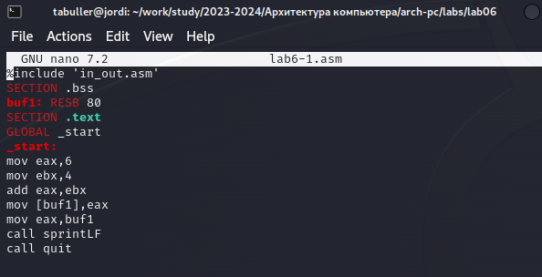{ #fig:001 width=90% }

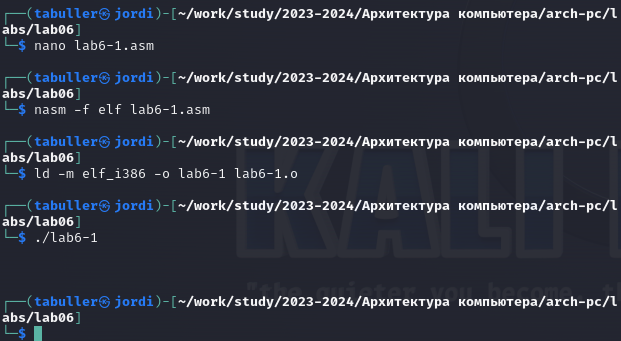{ #fig:001 width=90% }

Коду 10 соответствует символ VT (vertical tab). Это прозрачный символ - что-то такое, собственно, и вывелось на экран.

## Задание 4:
Преобразуем текст программы из Листинга 6.1 с использованием функций для преобразования ASCII символов в числа и обратно из файла ```in_out.asm```. Создайте файл ```lab6-2.asm``` и введите в него текст программы из листинга 6.2. Создайте исполняемый файл и запустите его.

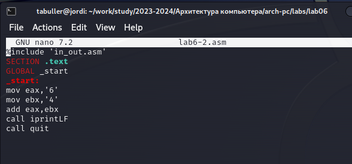{ #fig:001 width=90% }

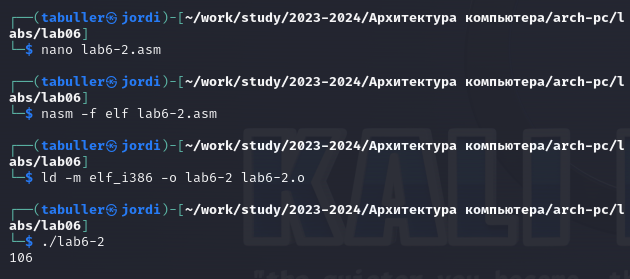{ #fig:001 width=90% }

В результат вывелось число 106: складываются коды символов '6' и '4', но функция iprintLF выводит число, а не символ, кодом которого является это число.

## Задание 5:
Аналогично предыдущему примеру изменим символы на числа. Создайте исполняемый файл и запустите его. Какой результат будет получен при исполнении программы?

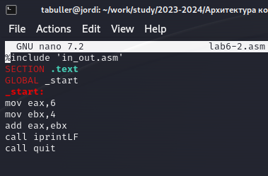{ #fig:001 width=90% }

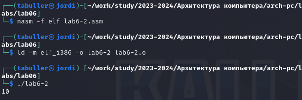{ #fig:001 width=90% }

В результат вывелось число 10: сложились сами числа, а не их коды;  программа отработала так, как было запланированно изначально.

### Задание 5.1:
Замените функцию iprintLF на iprint. Создайте исполняемый файл и запустите его. Чем отличается вывод функций iprintLF и iprint?

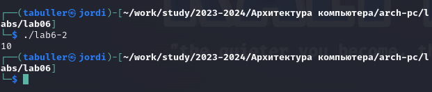{ #fig:001 width=90% }

Программа скомпилировалась без значительных изменений, но замена ```sprintLF``` на ```sprint``` привела к тому, что исчез символ переноса строки при выводе сообщения на экран.

## Задание 6:
Создайте файл ```lab6-3.asm``` и введите в него текст программы из листинга 6.3. Создайте исполняемый файл и запустите его.

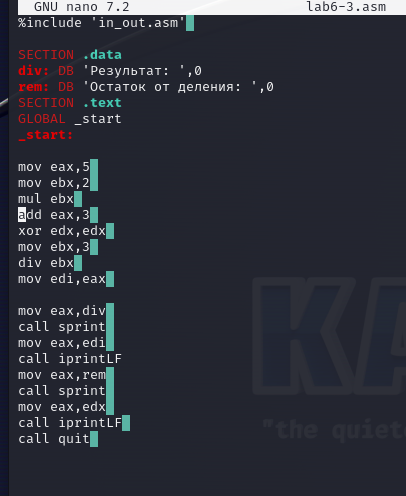{ #fig:001 width=90% }

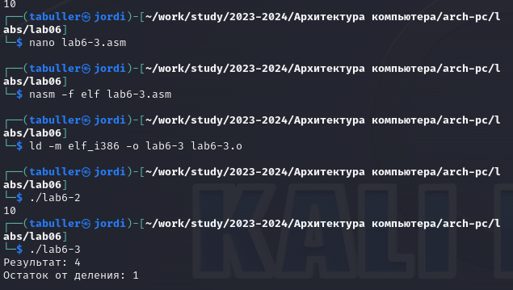{ #fig:001 width=90% }

Результат программы соответствует заданной функции: 13/3 при целочисленном делении даст результат 4 с отстатком 1.

### Задание 6.1:
Измените текст программы для вычисления выражения f(x) = (4 * 6 + 2)/5. Создайте исполняемый файл и проверьте его работу.

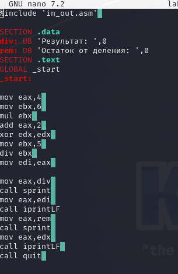{ #fig:001 width=90% }

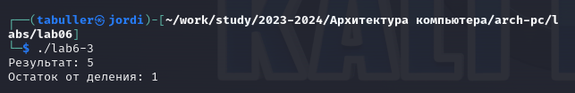{ #fig:001 width=90% }

Для изменения функции необходимо только заменить значения переменных. Результат остается верным: 26/5 при целочисленном делении дает 5 с остатком 1.

## Задание 7:
Создайте файл ```variant.asm``` и введите в него текст программы из листинга 6.4. Проверьте результат работы программы вычислив номер варианта аналитически.

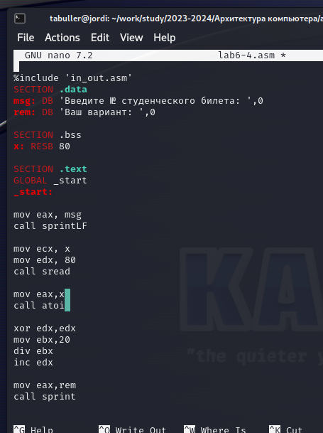{ #fig:001 width=90% }

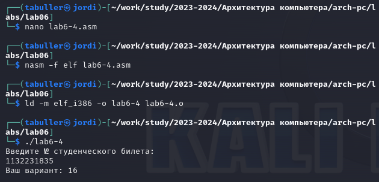{ #fig:001 width=90% }

Программа отрабатывает без ошибок, выводя в результат номер варианта 16. Проверим результат аналитически: 

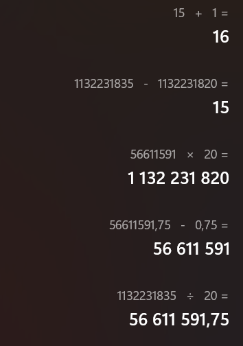{ #fig:001 width=90% }

Результаты совпадают: можно утверждать, что программа отработала верно при заданном номере студенческого билета.

## Задание 8:
Включите в отчет по выполнению лабораторной работы ответы на следующие вопросы:

### 1. Какие строки листинга 6.4 отвечают за вывод на экран сообщения 'Ваш вариант:'?

```mov eax,rem
call sprint```

### 2. Для чего используется следующие инструкции?
```mov ecx, x
mov edx, 80
call sread```

Эти инструкции выполняют считывание ввода пользователя, в дальнейшем полученное значение передается в переменную ```eax```.

### 3. Для чего используется инструкция "call atoi"?

Для преобразования ASCII символов в числа.

### 4. Какие строки листинга 6.4 отвечают за вычисления варианта?

```xor edx,edx
mov ebx,20
div ebx
inc edx```

### 5. В какой регистр записывается остаток от деления при выполнении инструкции "div ebx"?

```edx```

### 6. Для чего используется инструкция "inc edx"?

Увеличение на 1 значения регистра ```edx```.

### 7. Какие строки листинга 6.4 отвечают за вывод на экран результата вычислений?

```mov eax,edx
call iprintLF``` 

# Задание для самостоятельной работы

## Задание 8:
Написать программу вычисления выражения y = f(x). Программа должна выводить выражение для вычисления, выводить запрос на ввод значения x, вычислять заданное выражение в зависимости от введенного x, выводить результат вычислений. Вид функции f(x) выбрать из таблицы 6.3 вариантов заданий в соответствии с номером полученным при выполнении лабораторной работы. Создайте исполняемый файл и проверьте его работу для значений x1 и x2 из 6.3.

Функция в варианте 16: (10x − 5)^2. 
Разберем алгоритм: сперва программа должна получить ввод от пользователя (x), затем умножить полученное число на 10, вычесть из результата 5 и умножить новый результат сам на себя. Функции умножения и считывания ввода пользователя уже известны, функция для вычитания - ```sub```, ee синтаксис аналогичесн синтаксису команды ```add```.

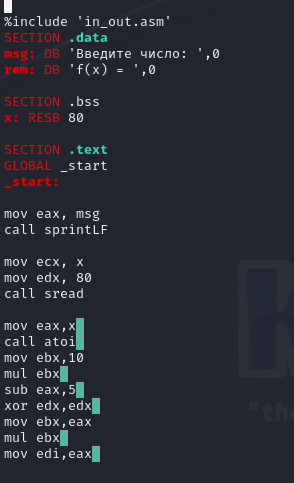{ #fig:001 width=90% }

Первый блок команд после команды "старт" вызывает сообщение 'Введите число'. Следующий блок считывает введенное число.
Далее переменной ```eax``` присваивается значение x, ```ebx``` - 10, после чего выполняется умножение ```ebx``` на ```eax```. Из результата в переменной ```eax``` вычитается 5, после чего полученное число умножается само на себя.

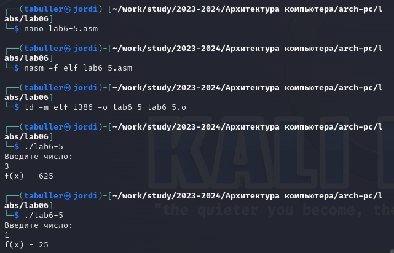{ #fig:001 width=90% }

Для предложенных чисел 3 и 1 программа выдает результаты 625 и 25 соответственно. Это сходится с результатами, которые можно получить при самостоятельном решении: программа отработала верно.

# Вывод
При выполнении лабораторной работы были освоены арифметические инструкции языка ассемблера NASM.


